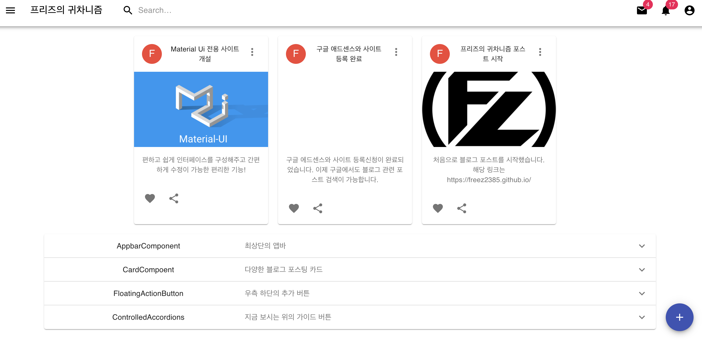

# react-material-ui-project

React의 Material UI 라이브러리만으로 응용해 작성해본 간단한 템플릿 사이트입니다.

참고한 사이트는 다음과 같습니다.

- [Material Ui document](https://material-ui.com/)

## 사용한 컴포넌트

- [Container](https://material-ui.com/components/container/)
- [Appbar](https://material-ui.com/components/app-bar/)
- [Card](https://material-ui.com/components/cards/)
- [Accordion](https://material-ui.com/components/accordion/)

## 표시 화면

